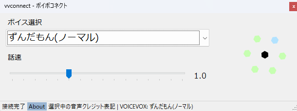
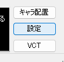
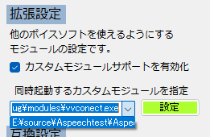
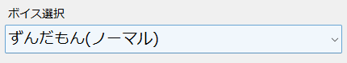
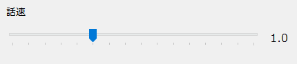

# ボイボコネクトプラグイン -vvconnect-
  

VOICEVOXの音声で実況動画配信ができるようにする代読くん(Rev.3.0以降)向けカスタムモジュール

  

本カスタムモジュールは[代読くん](https://github.com/yokonoha/daidoku_kun) Rev.3.0以降より利用可能です。  

<b>同梱版を選択してダウンロードされた方</b>は以下の通り設定を行ってください。  
1. 代読くん の設定を開きます  
  
1. 拡張設定のカスタムモジュールサポートを有効化ボタンを押し、同時起動するカスタムモジュールとして末尾にvvconnect.exeと書かれているものを選択し、設定ボタンを押します。  
  
(Tips!: この保存先名称は環境によって異なりますが、vvconnectと書かれていればOKです。)  
1. 代読くんを再起動します。  
これで準備は完了です。  

<b>同梱版以外をダウンロードされた方</b>はReleasesページから最新のバージョンをダウンロードし、代読くんと同じディレクトリ内に``modules``フォルダを用意し、そこにdllファイルとexeファイルをそのままコピーしてください。  
その後の設定手順は前述の通りです。  

起動時にVOICEVOXが見つからないというエラーが表示される場合、VOICEVOXが正しくインストールされているかを確認してください。  
また、インストールされているフォルダがデフォルト設定ではない場合(例:C:\\ではなくD:\\ドライブにインストールした場合など)は初回起動時にインストール先を聞かれますのでVOICEVOX.exeの場所を指定してください。  

### 注意  
このプラグインを起動すると、VOICEVOXも同時に起動されますが、このウィンドウは使用中閉じないでください。(タスクバーへの最小化は可能です。)  

### パラメータ設定について  
  
VOICEVOXが起動すると、話者リストが利用可能になります。  
こちらをクリックすることで利用中でもしゃべらせたい話者に切り替えることができます。  

こちらのパラメータは喋る速さを変更するものです。  
左側が遅く喋る、右側が早く喋る です。  

### 権利表記と利用上の留意事項  
VOICEVOXおよびその他の製品名、会社名、サービス名、キャラクター名称等は各権利者・各社の商標または登録商標です。  
本ソフトウェアではVOICEVOXのローカルAPIより、VOICEVOXに収録されているキャラクター名称を取得しています。  
ご利用の際はVOICEVOX開発元様の規約に従った利用をお願いいたします。(例: VOICEVOX: "キャラクター名称"などのクレジット表記を行う 等)  
また、本ソフトウェア(カスタムモジュール)をご利用になる上で、VOICEVOX開発元様や各権利者様、そのほかの方の迷惑になるような利用は固く禁じます。  

こちらの権利表記に関しましては、当ソフトウェアメイン画面下部のAboutボタンを押してもご覧いただけます。  
### 使用したコンポーネントのオープンソースライセンス表示  
使用させていただいたコンポーネントのオープンソースライセンス

Newtonsoft.Json
The MIT License (MIT)

Copyright (c) 2007 James Newton-King

Permission is hereby granted, free of charge, to any person obtaining a copy of
this software and associated documentation files (the "Software"), to deal in
the Software without restriction, including without limitation the rights to
use, copy, modify, merge, publish, distribute, sublicense, and/or sell copies of
the Software, and to permit persons to whom the Software is furnished to do so,
subject to the following conditions:

The above copyright notice and this permission notice shall be included in all
copies or substantial portions of the Software.

THE SOFTWARE IS PROVIDED "AS IS", WITHOUT WARRANTY OF ANY KIND, EXPRESS OR
IMPLIED, INCLUDING BUT NOT LIMITED TO THE WARRANTIES OF MERCHANTABILITY, FITNESS
FOR A PARTICULAR PURPOSE AND NONINFRINGEMENT. IN NO EVENT SHALL THE AUTHORS OR
COPYRIGHT HOLDERS BE LIABLE FOR ANY CLAIM, DAMAGES OR OTHER LIABILITY, WHETHER
IN AN ACTION OF CONTRACT, TORT OR OTHERWISE, ARISING FROM, OUT OF OR IN
CONNECTION WITH THE SOFTWARE OR THE USE OR OTHER DEALINGS IN THE SOFTWARE.  

こちらのオープンソースライセンス表示に関しましては、当ソフトウェアメイン画面下部のAboutボタンを押してもご覧いただけます。  